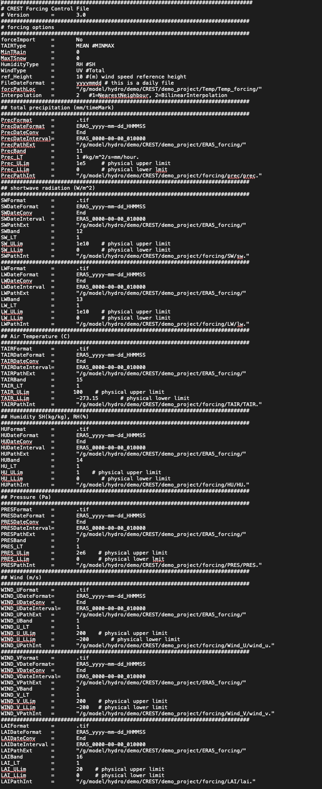

## forcing_control.txt

<pre>
################################################################################
# CREST Forcing Control File
# Version	=	3.0
###############################################################################
# forcing options
###############################################################################
forceImport	=	No
TAIRType	=	MEAN #MINMAX
MinTRain	=	0
MaxTSnow	=	0
HumidityType	=	RH #SH
WindType	=	UV #Total
ref_Height	=	10 #(m) wind speed reference height
FileDateFormat  =       yyyymmdd # this is a daily file
forcPathLoc	=	"/g/model/hydro/demo/CREST/demo_project/Temp/Temp_forcing/"
Interpolation   =       2   #1=NearestNeighbour, 2=BilinearInterpolation
###############################################################################
</pre>

