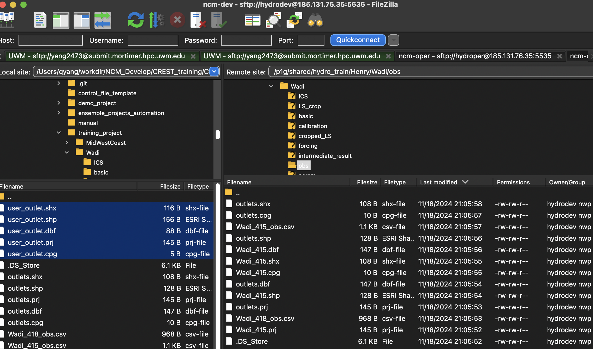

## Add and edit outlets
Keywords: `Hydrofabric`

 <b>(Henry) Qing Yang, PhD</b> 
 qing.2.yang@uconn.edu 
 

### Scope
This section presents the recommended steps for creating and editing outlets for hydrological modeling. Main software: QGIS.

### Goals

* Visualize the stream network.
* Create and edit outlet shapefile.

<ins> 1.	Load the stream.tif and visualize the river stream network </ins>

Step 1: Add Your Stream Raster
Go to Layer > Add Layer > Add Raster Layer to add your stream raster. For this example, we will use the stream provided in the trainning_project.

Path: CREST_tutorial/training_project/Wadi/basic/stream.tif

Locate the file path and push 'add'. Or directly drag into the sofware.

<ins> 2.	Define your outlet of interest </ins>

In Qgis, we can add/edit the outlet as a shapefile. At this stage, we can point/remove a simple outlet, along the stream network.

Step 1: Add an outlet layer.
Go to Layer > Create Layer > New Shapefile Layer to create your outlet shapefile.
Choose or type in the path of shapefile that would like to create.
Select point on the 'Geometry type'.

Step 2: Point the outlet on stream network.
Go to Layer > Toggle Editing 
Or locate the yellow pencil simbol on the tools panel.
Once editing tool enable, a yellow pencil will show up on the outlet layer.

On the toggle edit panel, click 'add point feature'. The mouse will change into a cross circle when moving in the raster visual zone.
Click on the stream line to add outlet. Use zoom in or out for better visualization.
Once clicked, a window will pop out asking for ID, type unique string/number for it and click 'OK'.

Step 3: Save outlet file.
Repeat step 2 untill reach the satisfied number of outlets. Clik 'Save Layer Edits' on the toggle editing panel.
Click Toggle Editing (yellow pencil) to exit editing mode.

<ins> 3.	Upload outlet shapefile to HPC </ins>
Locate the path of new outlet shapefile, using filezilla or winscp to upload it to the HPC.
It is recommened to upload using hydrodev account, or later copy outlet files using hydrodev account.
Upload the .shp, .shx, .dbf, .prj, and .cpg, as a complete shapfile format set.

Follow the tutorial on CREST training to setup new outlet on project file then test run.